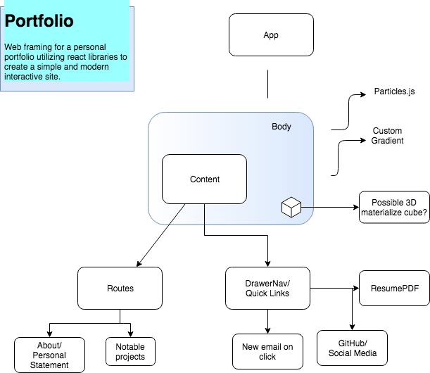

<h3 align="center"> Personal Portfolio</h3>
<h4 align="center"> By Devin Sweeting </h4>

## Description

_This is a personal portfolio site for Devin Sweeting. It will showcase web design skills in React and will also present past projects in Github. and allow users to contact Devin through email and download his resume._

# 

## Table of content

- [Installation](#installation)
- [Technology](#technology)
- [License](#license)

## Installation

1. Go to terminal and clone this repository:
```
$ git clone git repository link
```
2. Change into the project directory and install npm
```
$ npm install
```
3. Build the app:
```
$ npm run strart
```

## Component Tree

# 


## Completed Features
* Particle background with custom gradient backgroundColor.
* Draggable Body component
* Drawer right with menu options


## Planned Features
* Right Drawer will have downloadable pdf of Resume.
* Right Drawer will have link to open new Email with prefilled outgoing to personal email address.
* Link to github account and list live links to deployed github projects. (possible 3D square)
* Draggable Body Component will have routes to multiple pages

## Technology
* Javascript
* React
* HTML
* CSS

## License
* This project is licensed under the MIT License - see the LICENSE.md file for details
