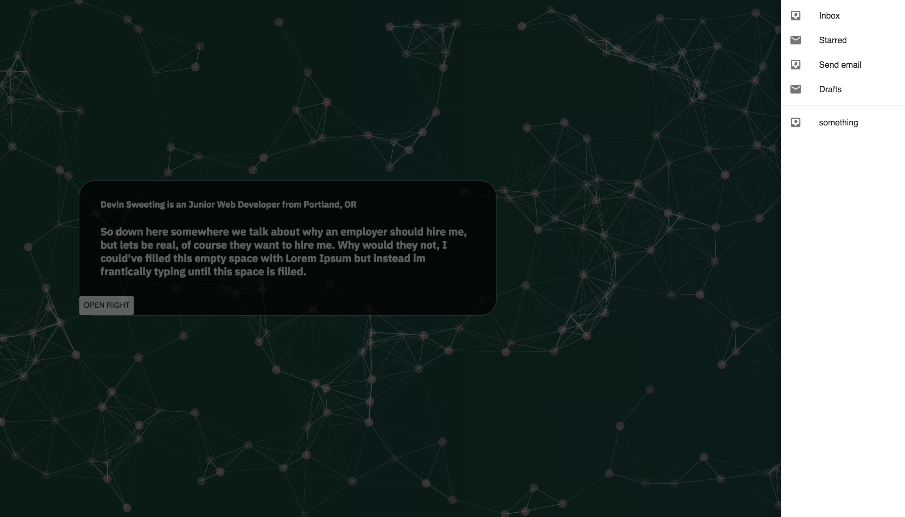

<h3 align="center"> Personal Portfolio</h3>
<h4 align="center"> By Devin Sweeting </h4>

## Description

_This is a personal portfolio site for Devin Sweeting. It will showcase web design skills in React. and will also cleanly present past projects in Github. and allow users to contact Devin through email and download his resume._

# 

## Table of content

- [Installation](#installation)
- [API Setup](#API)
- [Technology](#technology)
- [License](#license)

## Installation

1. Go to terminal and clone this repository:
```
$ git clone git repository link
```
2. Change into the project directory and install npm
```
$ npm install
```
3. Build the app:
```
$ npm run strart
```

## API
Create a file in the app folder named api-keys.ts
* Firebase: Go to google firebase console, create a project and get the app API key. Add the API key to the format below and add to file api-keys.ts.
```
export const masterFirebaseConfig = {
  apiKey:
   authDomain:
   databaseURL:
   projectId:
   storageBucket:
   messagingSenderId:
  };
```
* Weather: Go to openweathermap.org and register for an account. Add the API key to the format below and add to file api-keys.ts.
```
export const weatherApi = {
  apiKey:
  };
```
## Completed Features
* Particle background with custom gradient backgroundColor.
* Draggable Body component
* 


## Planned Features
* have Drawer to the Right have downloadable pdf of Resume.
* Link to open up new EMail with prefilled outgoing to personal email
* Link to github account and list live links to deployed github projects.

## Technology
* Javascript
* React
* HTML
* CSS

## License
* This project is licensed under the MIT License - see the LICENSE.md file for details
